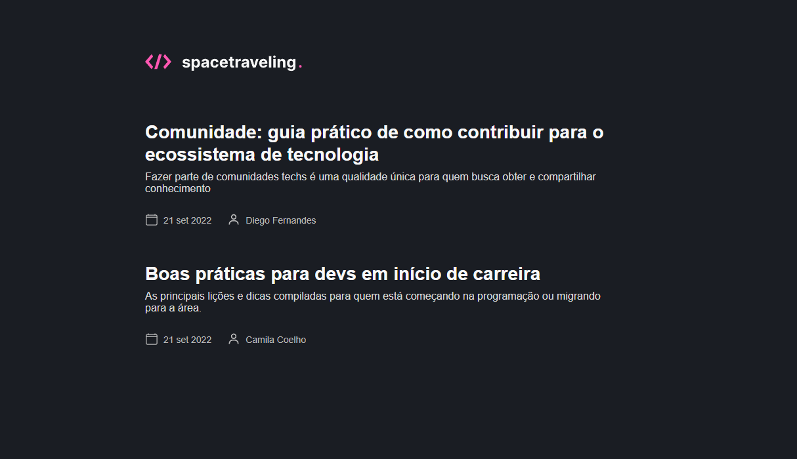

<h1 align="center">
<br>
  
<br>
<br>
</h1>

<p align="center">Desafio para criação de blog do zero com NextJs e CSM</p> 
 <p align="center">Desafio oferecido no curso IGNITE da <a href="https://www.rocketseat.com.br/">@rocketseat</a> </p>

<p align="center">
    
  </a>  
</p>

## ℹ Sobre

<p>O desafio consiste em criar uma pagina de para listagem e leitura de Posts.
</p>

 <p>A aplicação é construída com modelo <strong>Serveless</strong>, sem necessidade de criar uma API externa para manipular os dados</p>

## 🚀 Tecnologias utilizadas
- [Typescript](https://www.typescriptlang.org/)
- [NextJS](https://nextjs.org/)
- [Sass](https://sass-lang.com/)
- [Prismic.io](https://prismic.io/)


## 👉 Demonstração da aplicação
  

## 👨‍💻 Rodando na sua máquina

**1:** Clone o repositório.

```
git clone https://github.com/DiegoVSouza/spacetraveling.git

```

**2:** Acesse o diretório do projeto.

```
cd spacetraveling
```

**3:** Instale as depedências
```
  1- yarn

```
**4:** Inicie a aplicação.
```
   1- yanr start
   
```

